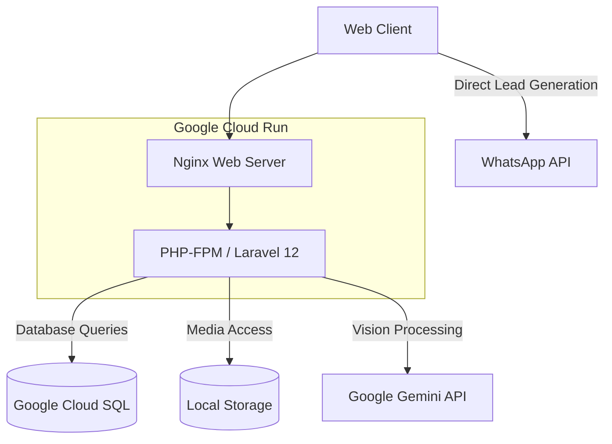
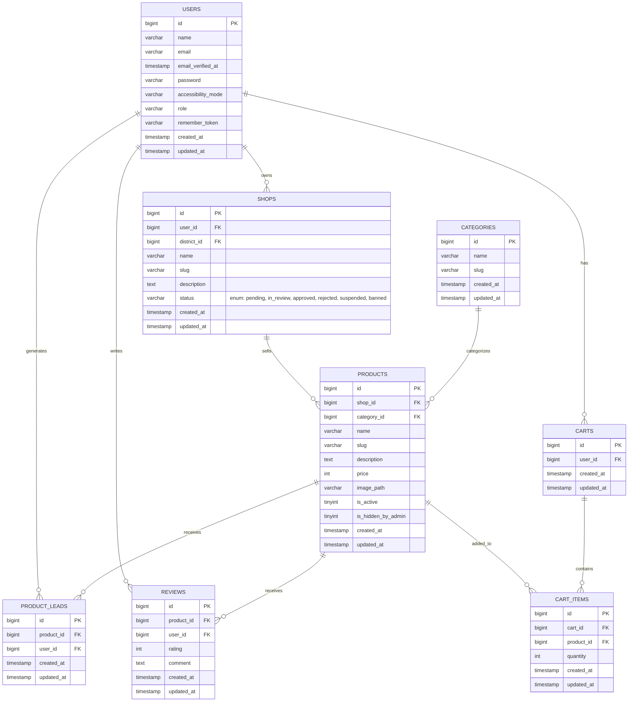

<div align="center">


  
  
  
  

  <br>
  <h1>FloraMart: Multi-Tenant Floriculture Marketplace</h1>
</div>

---

## Overview & Competition Pitch

FloraMart is a specialized multi-tenant e-commerce platform designed to bridge the gap between traditional florists and digital consumers. Operating as a marketplace, it enables local florists to establish digital storefronts while providing customers with an intuitive, geographically filtered catalog to source fresh flowers directly from local artisans. The application is built entirely on a monolithic Laravel 12 architecture, prioritizing speed, maintainability, and seamless user experiences.

For the **#JuaraVibeCoding Study Jam**, FloraMart is submitted under the **"Inclusive Access"** category, approaching inclusivity from two critical angles. First, it enables **Business Inclusion** for UMKM (Micro, Small, and Medium Enterprises). Traditional florists often lack the technical literacy to manage complex digital payment gateways and inventory systems. FloraMart solves this by utilizing a Direct WhatsApp Lead Generation system, allowing florists to receive orders through a familiar platform while the system tracks the lead natively. Second, it ensures **User Inclusion** via a sophisticated AI Accessibility Assistant powered by Google Gemini Vision. This feature analyzes the screen context and guides colorblind users (Protanopia, Deuteranopia, Tritanopia, and Achromatopsia) through the platform using shape and position-based descriptions, effectively removing visual navigation barriers.

## Core Features

* **Role-Based Access Control (RBAC):** Distinct interfaces and permissions for Platform Administrators (managing users, shops, and platform analytics), Shop Owners (managing individual catalogs and shop statuses), and Customers.
* **Direct WhatsApp Lead Generation:** Streamlined checkout process that redirects customers directly to the florist's WhatsApp, simplifying the transaction for traditional merchants while logging the lead for analytics.
* **2-Tier Geographic Filtering:** Advanced filtering utilizing Province, Regency, and District data models, ensuring customers find the closest florists to guarantee flower freshness and minimize delivery logistics.
* **AI Accessibility Assistant:** Gemini-powered vision integration that reads the active UI and generates highly empathetic, color-agnostic navigational instructions for visually impaired users.
* **Comprehensive E-Commerce Suite:** Fully functional shopping cart, wishlist management, and customer review systems.

## System Architecture



## Entity Relationship Diagram (ERD)



## Local Development Installation

Follow these steps to configure the application in a local environment:

1. **Clone the Repository**
   ```bash
   git clone <repository-url>
   cd floramart
   ```

2. **Install Dependencies**
   ```bash
   composer install
   npm install
   ```

3. **Environment Configuration**
   Copy the example environment file and configure it:
   ```bash
   cp .env.example .env
   ```
   *CRITICAL: You must provide a valid Gemini API key in your `.env` for the accessibility features to function.*
   ```env
   DB_CONNECTION=mysql
   DB_HOST=127.0.0.1
   DB_PORT=3306
   DB_DATABASE=floramart
   DB_USERNAME=root
   DB_PASSWORD=

   GEMINI_API_KEY=your_google_gemini_api_key_here
   ```

4. **Generate Application Key**
   ```bash
   php artisan key:generate
   ```

5. **Run Migrations and Seeders**
   Initialize the database schema and populate it with essential base data and products.
   ```bash
   php artisan migrate
   php artisan db:seed --class=ProductSeeder
   ```

6. **Create Storage Link**
   Ensure product images and uploaded media are publicly accessible.
   ```bash
   php artisan storage:link
   ```

7. **Compile Assets and Start Server**
   ```bash
   npm run build
   # OR for active development: npm run dev
   
   php artisan serve
   ```

## Docker & Cloud Run Deployment Guide

This application is strictly structured for stateless deployment on Google Cloud Run. The root directory contains specific configuration files to facilitate containerization:

*   **Dockerfile:** Utilizes a highly optimized, multi-stage build process based on Alpine Linux. It compiles frontend assets using Node.js in the first stage, then transfers the compiled artifacts to a PHP 8.2-FPM and Nginx environment. It automatically installs production-only Composer dependencies (`--no-dev --optimize-autoloader`).
*   **entrypoint.sh:** Acts as the container execution command. Prior to starting the Nginx and PHP-FPM daemons, it runs necessary Laravel cache commands (`config:cache`, `route:cache`, `view:cache`) and establishes the local storage symlink required for media persistence.
*   **nginx.conf:** Contains tailored routing rules pointing to the `/public` directory, managing `index.php` routing securely without exposing framework internals.

To deploy, authenticate with Google Cloud CLI, build the image via Cloud Build, and deploy to Cloud Run ensuring port `8080` is exposed and the necessary `.env` variables (including the Cloud SQL connection string and `GEMINI_API_KEY`) are passed to the service.

## Production Email Verification (SMTP)

For production environments, ensure you configure an SMTP provider (such as Resend or Mailtrap) within the `.env` variables to handle user registration and email verification securely:

```env
MAIL_MAILER=smtp
MAIL_HOST=smtp.resend.com
MAIL_PORT=465
MAIL_USERNAME=resend
MAIL_PASSWORD=your_secure_password
MAIL_ENCRYPTION=tls
MAIL_FROM_ADDRESS=noreply@floramart.com
MAIL_FROM_NAME="${APP_NAME}"
```

## Developer Contact

**Mualif Akhyar**
Instagram: [@mualifakhyar_](https://instagram.com/mualifakhyar_)
