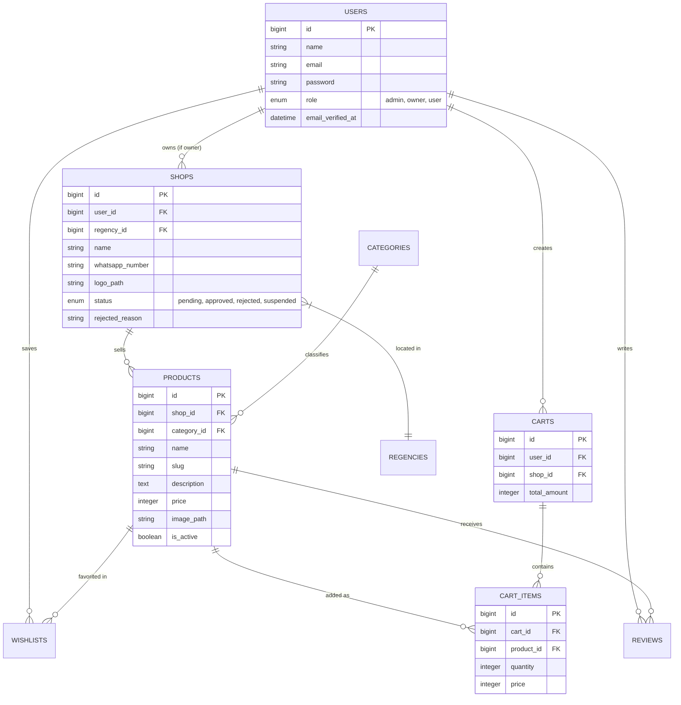

<div align="center">
  
  
  
  
  <br>
  <h1>FloraMart Marketplace</h1>
  <p>Platform E-Commerce Modern Khusus untuk Pengrajin dan Pecinta Bunga</p>
</div>

---

##  Deskripsi Proyek

**FloraMart** adalah sebuah aplikasi web *marketplace* yang dirancang secara spesifik untuk mewadahi ekosistem jual-beli bunga dan tanaman hias. Dibangun menggunakan arsitektur monolitik modern dengan **Laravel 12**, aplikasi ini memungkinkan pengguna untuk tidak hanya membeli produk, tetapi juga membuka toko bunga *(Florist)* mereka sendiri.

Aplikasi ini mendemonstrasikan kapabilitas implementasi *Role-Based Access Control* (RBAC), antarmuka dinamis (Tailwind CSS + Alpine.js), keamanan transaksi pesanan via WhatsApp, serta sistem *database* relasional yang kompleks dan terstruktur.

---

##  Fitur Berdasarkan Role

Aplikasi ini menggunakan 3 lapisan peran pengguna (*role*):

### 1.  Admin
- Mengelola persetujuan (*approval*), penolakan, atau penangguhan (*suspend*) pendaftaran toko baru lengkap dengan sistem pencatatan alasan (*reason tracking*).
- Menurunkan atau menaikkan *role* akun pengguna (Otomatis menghapus data toko apabila diturunkan menjadi *user* biasa).
- Mengakses statistik dan data analisis platform secara penuh.

### 2.  Owner (Pemilik Toko)
- Mendaftar toko baru secara dinamis berdasarkan data wilayah (Provinsi, Kabupaten, Kecamatan).
- Mengelola katalog produk bunga (Buat, Baca, Perbarui, Hapus).
- Mengelola profil toko dan ketersediaan nomor WhatsApp untuk menerima pesanan langsung dari pelanggan.

### 3.  User (Pembeli)
- Menjelajahi katalog produk dari semua toko.
- Menyimpan produk ke daftar "Bunga Favorit Saya" (Wishlist).
- Menambah produk ke keranjang belanja (*Cart*).
- Melakukan *Checkout* langsung yang terhubung secara mulus ke nomor WhatsApp pembuat produk (*Owner*) dengan sistem sanitasi format nomor.

---

##  Arsitektur & Entity-Relationship Diagram (ERD)

Di bawah ini adalah pemodelan *database* (ERD) yang memperlihatkan alur dan relasi antar entitas di dalam FloraMart:



---

##  Panduan Instalasi (Development)

Untuk menjalankan proyek ini di lingkungan lokal Anda, pastikan sistem Anda telah terpasang:
- **PHP** >= 8.2
- **Composer** (Dependency Manager)
- **Node.js** & **NPM**
- **MySQL** / MariaDB

### Langkah-Langkah:

1. **Clone Repositori**
   ```bash
   git clone https://github.com/Vraken9/Floramart.git
   cd Floramart
   ```

2. **Instalasi Dependensi PHP & Node.js**
   ```bash
   composer install
   npm install
   ```

3. **Konfigurasi Environment**
   Salin file konfigurasi bawaan dan hasilkan kunci aplikasi baru:
   ```bash
   cp .env.example .env
   php artisan key:generate
   ```
   *Penting:* Buka file `.env` dan sesuaikan koneksi database (`DB_DATABASE`, `DB_USERNAME`, `DB_PASSWORD`) dengan lokal Anda.

4. **Migrasi dan Injeksi Data Dummy (Penting untuk Penilaian)**
   Perintah ini akan membuat struktur tabel dan mengisi database dengan *dummy data* berskala besar (Ratusan produk beserta 9 toko) agar web langsung dapat diuji.
   ```bash
   php artisan migrate:fresh --seed
   php artisan db:seed --class=DummyDataSeeder
   ```

5. **Tautkan Storage**
   Untuk memastikan gambar lokal bisa diakses dari antarmuka web:
   ```bash
   php artisan storage:link
   ```

6. **Jalankan Aplikasi**
   Jalankan server Vite (untuk *hot-reload* aset) dan Laravel secara bersamaan:
   ```bash
   npm run dev
   php artisan serve
   ```
   Aplikasi kini dapat diakses melalui `http://localhost:8000`.

---

## Panduan Deployment dengan Docker (Produksi)

Aplikasi ini sudah dilengkapi dengan `Dockerfile` dan `docker-compose.yml` untuk memudahkan proses *deployment* di server VPS atau Cloud.

1. Salin repositori ke server Anda.
2. Pastikan file `.env` sudah dikonfigurasi (terutama kredensial *database*).
3. Jalankan perintah berikut di dalam direktori proyek:
   ```bash
   docker-compose up -d --build
   ```
4. Aplikasi akan berjalan otomatis di *port* `8000`. Anda bisa menghubungkannya dengan *Reverse Proxy* seperti Nginx atau Traefik untuk mengarahkannya ke *domain* utama Anda.

---

## Strategi Verifikasi Email di Tahap Produksi

Secara bawaan (*local development*), sistem menggunakan konfigurasi `MAIL_MAILER=log`, di mana tautan verifikasi hanya masuk ke file `storage/logs/laravel.log`.

Untuk tahap produksi *(live)*, ikuti langkah berikut agar email benar-benar terkirim ke *inbox* pengguna secara gratis dan profesional:
1. Daftar di layanan penyedia SMTP gratis seperti **Resend**, **Mailtrap**, atau **Brevo (Sendinblue)**.
2. Dapatkan *API Key* / kredensial SMTP Anda.
3. Ubah pengaturan di file `.env` server Anda menjadi:
   ```env
   MAIL_MAILER=smtp
   MAIL_HOST=smtp.resend.com
   MAIL_PORT=465
   MAIL_USERNAME=resend
   MAIL_PASSWORD=re_kode_rahasia_anda_di_sini
   MAIL_ENCRYPTION=tls
   MAIL_FROM_ADDRESS="noreply@domainanda.com"
   MAIL_FROM_NAME="FloraMart"
   ```
Dengan konfigurasi ini, verifikasi email dapat berjalan otomatis tanpa mengelola *mail server* sendiri.

---

##  Developer & Kontak

Proyek ini dibangun sebagai dedikasi terhadap pengembangan aplikasi web fungsional yang estetis dan interaktif.

**Dikembangkan oleh:**
- **Mualif Akhyar**
- 📸 Instagram: [@mualifakhyar_](https://www.instagram.com/mualifakhyar_)

*Silakan hubungi melalui media sosial di atas untuk pertanyaan, masukan, atau diskusi teknis.*
